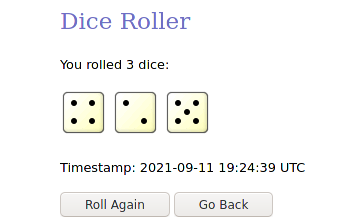

# UpperBound

## Overview

The object of this game is to complete one full revolution around the game board by rolling dice.
At the beginning of each round, someone will roll two out of the three dice to set the number to attain.
This desired number is obtained by multiplying the values of the two dice.
After setting the initial seed, all players will roll the three dice and sum up all the sides.
The player with the closest score to the intended value to reach will advance one space.

## Objectives

There are a few conditions which will guarantee movement:

- All sides of the dice are the same
    * [1, 1, 1], [2, 2, 2], etc
    * This will allow moving forward one space for free
    * 
- All sides of the dice are even
    * [2, 4, 6], etc
    * This will allow swapping with a character ahead of you on the game board
- All sides of the dice are odd and not homogeneous
    * [1, 5, 3] is valid
    * [1, 1, 1] is not valid
    * This will move the player one space backwards

## Rules

- Players cannot advance if they did not obtain a win condition in that round
    * However, players are not forced to go one step backwards if they lose
    * This rule can be overridden if need be, to increase the game's complexity and time frame
- A player wins if and only if they complete one full revolution around the game board
    * This means starting at the origin and ending back at the origin by moving forward
- Players can only swap if all sides of the dice are even
    * The player who is swapped with cannot object and must allow it to happen
- If a tie occurs between two or more players, a game of rock, paper, scissors is conducted
    * The winner of the match will be allowed to advance
    * The loser will stay in the same position
    * As a substitute, players can opt to re-roll and add to their existing score
        + This would function much like Black Jack, where you would hit until the target number
        + However, players that breach the intended number will be forced to take one step backwards
- If a player rolls all evens and same number, then both rules will apply:
    * Swap with a player
    * Advance one space
    * For example: [2, 2, 2]
    * 

## Illustration

- The creation of our game board is quite simple:
    * With a piece of paper, draw a box following the edges
    * Then create another box inside the box you just drew. Follow the above procedure
    * Here is where the players of the game can determine the number of spaces there are
        + This will determine the overall length of the game
        + 
- Game pieces can be any small object that will fit on a sheet of paper
    * In this example, we will be using coins (a penny, a dime and a nickel)
    * 

- To start of each round, you will need to roll two out of the three dice
    * 
- To obtain the intended number to reach, multiply both values together. In this case the number is `24`.
- Each player will roll all three dice and sum up the values
    *  **Player 1: [6] (Penny)**
    *  **Player 2: [11] (Dime)**
    *  **Player 3: [12] (Nickel)**
- In this instance, player 3 is the victor and can advance their piece on the board by one
- 
- Repeat this step until there is a victor
